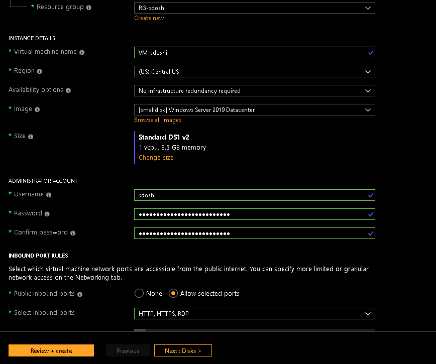

# Welcome to the Cloud Workshop!

## Quick Links:
- [Azure Portal](https://portal.azure.com)
- [Teams Meeting]()

# Demos Instructions:
1. [Create a Resource Group](##create-a-resource-group)
2. [Create a Virtual Machine](##create-a-vm)
3. [Deploy IIS](##deploy-iis)
4. [Block HTTP](##block-http)
5. Create an Azure Web Site
6. Create a budget


## Create a Resource Group
A resource group is a logical container that will be throughout the rest of this workshop.

1. Login to the [Azure Portal](https://portal.azure.com) with your company email address.
2. Click on "Cloud Shell" Icon at the top right of the Azure portal 
3. Select PowerShell as your default language. 
4. Select a subscription to store cloud shell data (less than 5 MB of data will be stored). 
5. After a few seconds Cloud Shell will initialize. 
6. Click into Cloud Shell and enter the command: `az group create --name RG-<yourname> --location central-us` and hit enter


7. The command will return json if sucessfull 
###Verify Resource Group Creation
8.  On the left menu bar click the `Resource Groups` button and search for your Resource Group 


## Create a VM
A Virtual Machine is the core resource of Infrastructure as a Service (IaaS).  Let's create a Windows Server VM using the Azure Portal.  You could also do this using Cloud Shell [code here](##vm-create-through-code) or ARM Template.
1. Click on the `+ New Resource` 
2. Search for `Windows Server` 
3. Select `Server 2019 Datacenter` and click Create 
4. Chose the following options: 
VM Name: `VM-<yourname>` 
Administartor name: `<yourname>`
Password: `This is a strong password!`
Inbound ports: HTTP, HTTPS, RDP

5. Click `Review and Create` and then `Create`
6. Click `Resource Groups` on the left, then click your Resource Group (`RG-<yourname>`)
7. Click on the Virtual Machine (note the computer icon to the left of the VM) 
8. Find the VM's Publick IP 
9. On your laptop open Remote Desktop Connection
10. Enter your VM's public IP into the "Computer" text box of the Remote Desktop Connection box 
11. On the username/password screen choose More Options and select "Other account" 
12. Login with the admin username and password you created before


## Deploy IIS
1. Open cloud shell
2. Type in the following (Please remember to change VMName and ResourceGroupName):
```powershell
Set-AzVMExtension `
    -ResourceGroupName "RG-sdoshi" `
    -VMName "VM-sdoshi" `
    -ExtensionName "IIS" `
    -Location "CentralUS" `
    -Publisher Microsoft.Compute `
    -ExtensionType CustomScriptExtension `
    -TypeHandlerVersion 1.8 `
    -SettingString '{"commandToExecute":"powershell Add-WindowsFeature Web-Server; powershell Add-Content -Path \"C:\\inetpub\\wwwroot\\Default.htm\" -Value $($env:computername)"}'
```
3. Find the VM's public IP
4. Open a new tab and go to `http://<publicip>`

## Block HTTP
Firewall rules in Azure are easy to create and manage.  Let's go back and block port 80 on the VM we created earlier.
1. Click on Resource Groups in the left, and click on your Resource Group, then find the network security group for your VM `vm-<yourname>-nsg`

2. Click on Inbound Security Rules

3. Click on HTTP 80 to view the rules
4. Flip the rule from `ALLOW` to `DENY` and click save

5. Now try to hit your VM's website again and it will be inaccessible.


# Appendix:
## VM Create Through Code
1. Open CloudShell
2. First grab an admin/password:
`$cred = Get-Credential`
3. Create a new VM
```powershell
New-AzVm `
    -ResourceGroupName "RG-sdoshi" `
    -Name "VM-sdoshi" `
    -Location "Central US" `
    -VirtualNetworkName "VM-sdoshi-vnet" `
    -SubnetName "mySubnet" `
    -SecurityGroupName "VM-sdoshi-nsg" `
    -PublicIpAddressName "VM-sdoshi-pip" `
    -OpenPorts 80,443,3389 `
    -Credential $cred
```